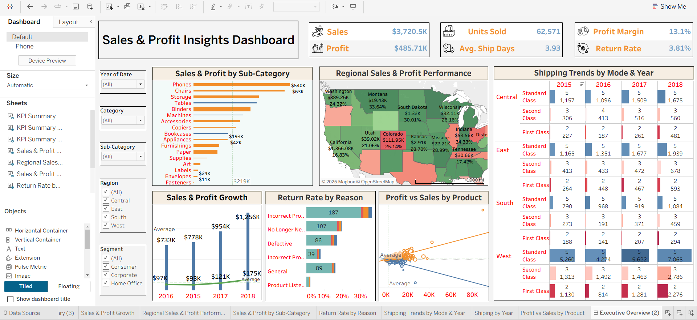
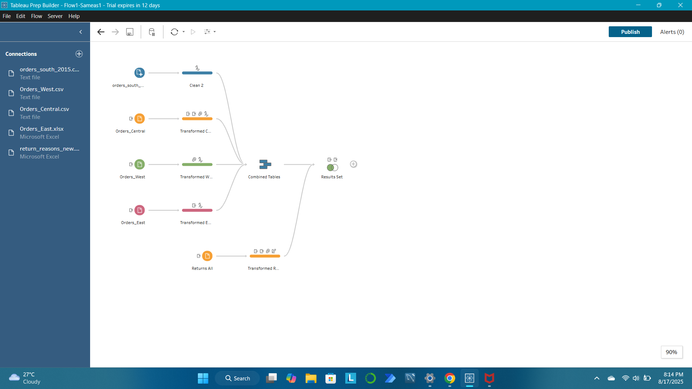

# Regional Sales Performance Analysis (Tableau) 🗺️

## 1. Overview
Developed a dynamic and visually compelling dashboard in Tableau to analyze sales, profit, and order trends across various geographic regions. The project utilizes Tableau's strengths in spatial analysis to quickly identify top-performing and underperforming markets.

## 🖼️ Executive Performance Overview
This visual represents the final, polished dashboard, designed for executive consumption. It integrates key performance indicators (KPIs) and multiple visualization types (Geo-Map, Bar/Line Charts, Heatmap Tables) to provide holistic insights into:

* **Regional Sales & Profit Distribution**
* **Year-over-Year (YoY) Performance Trends**
* **Product Sub-Category Profitability**
* **Return Rate Analysis**

****

---

## 2. Data Preparation and Transformation Flow (Tableau Prep)
Effective visualization starts with clean, integrated data. This screenshot highlights the complex data preparation pipeline required to merge and clean data sourced from multiple disparate files (e.g., Regional Orders CSVs and Return Reasons Excel files).

* **Key Steps Demonstrated:**
    * **Multi-Source Ingestion:** Connecting to different file types (CSV, Excel).
    * **Data Cleaning & Transformation:** Steps like `Clean 2`, `Transformed E`, etc.
    * **Union/Joining:** Combining regional sales data into a `Combined Tables` node.
    * **Relationship Mapping:** Joining sales data with `Returns` based on keys.
    * **Output Creation:** Generating the clean `Results Set` for the Tableau Desktop visualization layer.

****

---

### 🎯 Goal
To provide sales leadership with an interactive tool to visualize market performance spatially, enabling data-driven decisions regarding regional resource allocation and targeted marketing campaigns.

## 2. Tools & Technologies
- **Business Intelligence:** **Tableau Desktop**
- **Data Preparation:** Tableau Prep / SQL (Used for joining and cleaning source data)
- **Advanced Features:** **Geographic Mapping**, Dynamic Parameters, Calculated Fields, [Optional: LOD Expressions]
- **Visualization:** Interactive Maps, Treemaps, Bar-in-Bar Charts

## 3. Key Actions / Process (Visualization & Interactivity)
- **Data Joining:** Connected multiple data sources (e.g., Sales Transactions, Regional Hierarchies) and optimized joins for Tableau's performance.
- **Geographic Analysis:** Created a primary interactive **Filled Map**  to display Sales and Profit by state/province, allowing for immediate visual market assessment.
- **Calculated Fields:** Built custom calculations for **Profit Ratio**, **Discount Impact**, and **Sales MoM Change** to drive metric cards.
- **Dashboard Interactivity:** Implemented **Dashboard Actions** (Filter/Highlight) allowing users to click on a region in the map and drill down to related time-series charts and product details.
- **Time Analysis:** Used reference lines and dual-axis charts to compare current period sales against sales targets or prior periods.

## 4. Key Achievements & Results
- **Visual Storytelling:** Delivered a clean, intuitive dashboard that significantly reduced the time required for the Sales team to analyze regional performance.
- **Market Identification:** Quickly and clearly exposed **lagging geographic markets** which were masked in traditional spreadsheet reports, enabling targeted interventions.
- **Tableau Mastery:** Demonstrated advanced proficiency in Tableau by using its core features (Maps, Parameters, Actions) to create a highly functional and exploratory report.

## 5. View Project
- **Live Interactive Dashboard:** [Insert Your Tableau Public Link HERE]
- **Source File:** [Your Tableau Workbook Name].twb / .twbx (Available in this repository)
